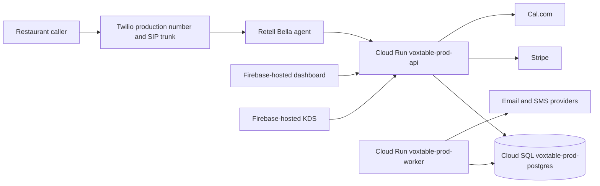
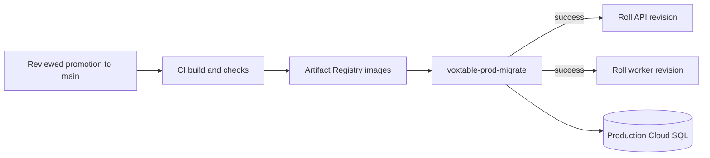

# VoxTable architecture

For operational detail, read the root `CLAUDE.md`, `AGENTS.md` and
`apps/backend/docs/gcp-deployment.md`.

## Production request path

Production resources live in `bp-voxtable-prod`. The API and worker run as
separate Cloud Run services, and the migration runner is a separate Cloud Run
job. Runtime secrets come from Secret Manager; infrastructure is managed in
`biteperk-cloud-platform`.

`core-central-vm` is an isolated sandbox and is deliberately absent from the
production diagram. It does not serve production traffic and its data is not a
production bootstrap, backup or migration source.

## Deployment and schema flow

The migration job runs from the new API image and must succeed before either
service rolls. Database migrations are append-only and run as `voxtable_owner`;
runtime services connect as `voxtable_app`.

Production application data is created directly in the production environment
through reviewed onboarding/admin paths. Staging and sandbox data never promote.

## Recovery

- Application recovery: route Cloud Run traffic to a known-good revision, then
  restore `--to-latest` after the fix.
- Database recovery: Cloud SQL automated backup or point-in-time recovery into
  a reviewed replacement instance.
- Integration recovery: disable the relevant Terraform-managed kill switch.
- Never use the sandbox VM as a production rollback target.
