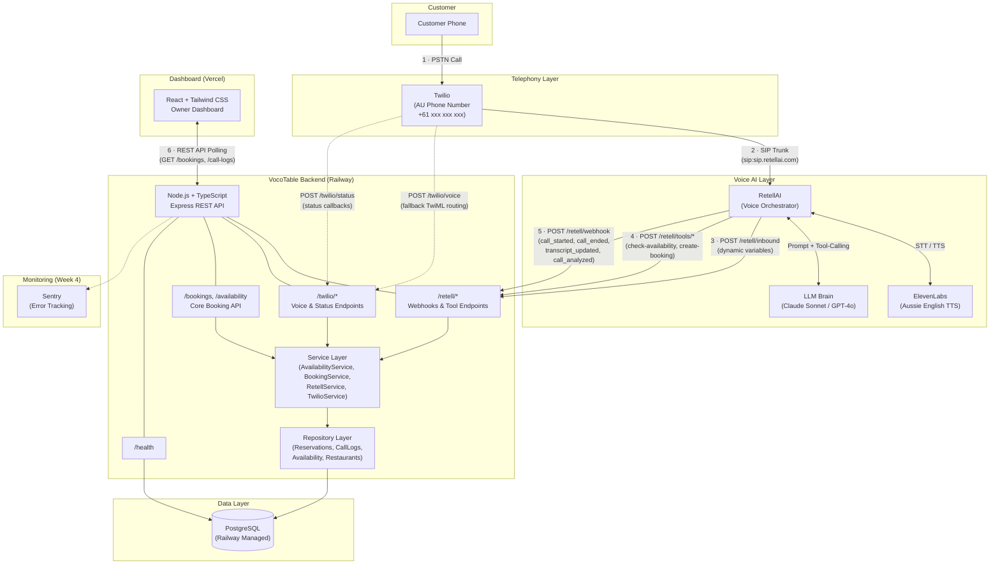
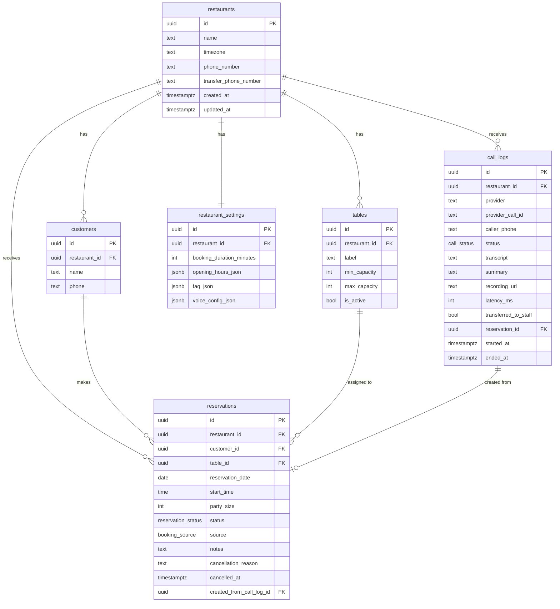
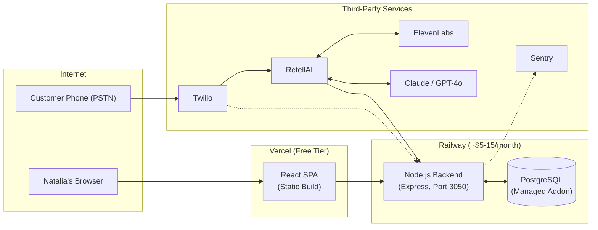
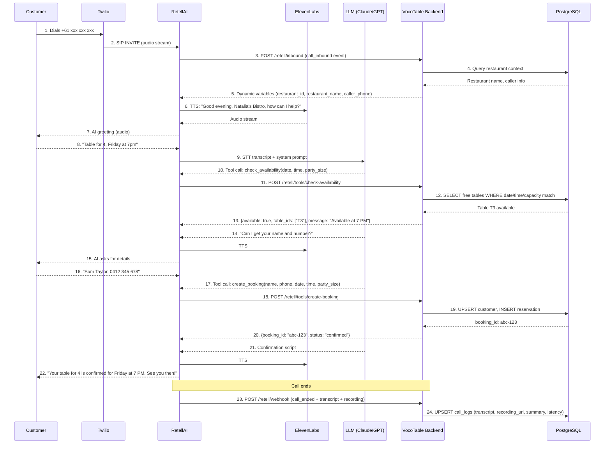
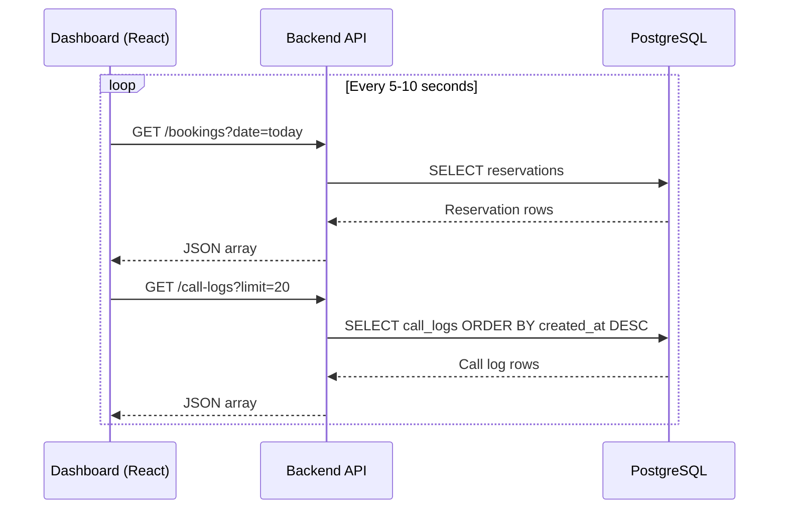

# VocoTable — High-Level Architecture

> Voice AI booking platform for restaurants.
> MVP target: Natalia's Bistro, Sydney — live within 30 days.

---

## 1. System Overview

VocoTable replaces a restaurant's third-party booking tool with an AI voice agent that answers phone calls, takes reservations, and writes every booking into a system the owner controls. The restaurant owner (Natalia) monitors calls, bookings, and analytics through a real-time web dashboard.

### End-to-End Call Journey (30-second summary)

1. A customer dials the restaurant's Australian phone number.
2. **Twilio** receives the call and routes it via SIP Trunk to **RetellAI**.
3. **RetellAI** orchestrates the conversation: it streams audio through **ElevenLabs** (Aussie English voice) and makes decisions through an **LLM** (Claude Sonnet / GPT-4o).
4. When the LLM needs to check table availability or create a booking, it calls **custom functions** on the **VocoTable Backend**.
5. The backend queries **PostgreSQL**, reserves a table, and returns a confirmation to the LLM.
6. The AI confirms the booking to the caller.
7. RetellAI sends **lifecycle webhooks** (transcript, recording, call analysis) to the backend.
8. The **React Dashboard** polls the backend and shows the new booking and call transcript to Natalia in real time.

---

## 2. Architecture Diagram



---

## 3. Layer-by-Layer Breakdown

### 3.1 Telephony Layer — Twilio

| Concern | Detail |
|---|---|
| Phone number | Australian mobile/landline number (+61) |
| Routing method | Twilio Elastic SIP Trunking, origination URI `sip:sip.retellai.com` |
| Status callbacks | `POST /twilio/status` — logs call state transitions |
| Fallback voice webhook | `POST /twilio/voice` — returns TwiML that dials the RetellAI SIP URI |
| Monthly cost | ~$5 (number rental + per-minute PSTN) |

Twilio owns the number and the PSTN interconnect. It does **not** run any AI logic — it simply bridges the caller's audio to RetellAI via SIP.

### 3.2 Voice AI Layer — RetellAI + ElevenLabs + LLM

| Component | Role |
|---|---|
| **RetellAI** | Session manager. Receives SIP audio from Twilio, runs STT, orchestrates the LLM turn-by-turn, calls ElevenLabs for TTS, and executes custom functions on the backend. |
| **ElevenLabs** | Text-to-speech engine. Configured with an Australian English female voice to match Natalia's brand. Integrated through RetellAI — no direct backend integration. |
| **LLM (Claude Sonnet / GPT-4o)** | The conversational brain. Follows a system prompt that covers: greeting, collecting booking details, checking availability (tool call), confirming the reservation (tool call), answering FAQs, and gracefully transferring to staff for edge cases. |

#### RetellAI Custom Functions (Tool Calls)

The LLM executes two backend functions during a call:

| Function | Backend Endpoint | Purpose |
|---|---|---|
| `check_availability` | `POST /retell/tools/check-availability` | Given a date, time, and party size — query Postgres for open tables |
| `create_booking` | `POST /retell/tools/create-booking` | Confirm the reservation, insert into `reservations`, return booking ID |

Both functions can also be routed through a generic dispatcher at `POST /retell/functions` which reads the `name` field from the payload.

#### RetellAI Webhooks (Lifecycle Events)

| Webhook | Events | What the backend does |
|---|---|---|
| `POST /retell/inbound` | `call_inbound` | Returns dynamic variables (restaurant name, caller phone, restaurant ID) so the agent can personalize the greeting |
| `POST /retell/webhook` | `call_started`, `call_ended`, `call_analyzed`, `transcript_updated`, `transfer_started`, `transfer_bridged`, `transfer_cancelled`, `transfer_ended` | Upserts call state, transcript, recording URL, latency metrics, and call summary into `call_logs` |

### 3.3 Backend — Node.js + TypeScript (Railway)

The backend is a monolithic Express server with a clean layered architecture:

```
apps/backend/src/
├── server.ts              ← Entry point, graceful shutdown (SIGTERM / SIGINT)
├── app.ts                 ← Express app factory, middleware, router mount
├── config/
│   └── env.ts             ← Zod-validated environment variables
├── domain/
│   ├── types.ts           ← Shared TypeScript types and interfaces
│   └── errors.ts          ← AppError class for structured error responses
├── routes/
│   ├── health.ts          ← GET / (HTML landing page) + GET /health (DB connectivity check)
│   ├── availability.ts    ← POST /availability/check
│   ├── bookings.ts        ← POST /bookings, PATCH /bookings/:id, POST /bookings/:id/cancel
│   ├── retell.ts          ← POST /retell/webhook, /retell/inbound, /retell/functions, /retell/tools/*
│   └── twilio.ts          ← POST /twilio/voice, /twilio/status
├── services/
│   ├── availabilityService.ts  ← Table-availability logic (time-window overlap, suggestion offsets)
│   ├── bookingService.ts       ← Create / update / cancel booking, customer upsert, advisory locking
│   ├── retellService.ts        ← Signature verification, webhook handling, function dispatch
│   └── twilioService.ts        ← Signature verification, TwiML generation, status mapping
├── repositories/
│   ├── availability.ts    ← SQL: find free tables for a given slot
│   ├── reservations.ts    ← SQL: insert / update / query reservations, upsert customers
│   ├── callLogs.ts        ← SQL: upsert call logs by (provider, provider_call_id)
│   └── restaurants.ts     ← SQL: restaurant settings lookup + transfer phone number
├── http/
│   ├── asyncHandler.ts    ← Async route wrapper
│   ├── errorHandler.ts    ← Global error middleware (AppError + ZodError + 500 fallback)
│   ├── requestLogger.ts   ← Structured request logging
│   └── schemas.ts         ← Zod request validation schemas (dual snake_case / camelCase)
├── db/
│   ├── pool.ts            ← pg Pool singleton with SSL toggle
│   ├── migrate.ts         ← Sequential migration runner with schema_migrations tracking
│   └── seed.ts            ← Seed data (Natalia's Bistro, 7 tables, settings, FAQs)
├── utils/
│   └── time.ts            ← Time arithmetic, opening-hours checks, voice-friendly formatting
└── scripts/
    ├── smoke-local.ts     ← Smoke test: health, availability, create/update/cancel booking
    ├── smoke-retell.ts    ← Smoke test: RetellAI inbound, webhook, and custom function endpoints
    └── smoke-twilio.ts    ← Smoke test: Twilio voice and status callback endpoints
```

#### Key Architecture Decisions

| Decision | Rationale |
|---|---|
| Single-tenant runtime, multi-tenant data model | Every table carries `restaurant_id`. When we onboard restaurant #2, no schema migration is needed. |
| Raw SQL via `pg`, no ORM | Keeps the dependency surface small and queries transparent. 6 tables do not justify an ORM. |
| Zod for request + env validation | Runtime type safety at the boundary — catches bad data from RetellAI or Twilio before it hits the DB. |
| `rawBody` capture on Express | Required for RetellAI and Twilio signature verification, which hash the raw request body. |
| Polling (not WebSockets) for dashboard | Simpler to ship. WebSocket upgrade is a known future improvement if latency requirements increase. |
| `pg_advisory_xact_lock` for booking creation | Prevents double-booking race conditions. The lock key is `restaurant_id:date`, so concurrent bookings for different dates do not block each other. |
| Dual-casing request schemas (`snake_case` + `camelCase`) | RetellAI and the dashboard may send either `party_size` or `partySize`. Zod schemas accept both forms and normalize internally, eliminating integration friction. |
| Sequential file-based migrations | A `schema_migrations` table tracks which `.sql` files have been applied. Each migration runs in a transaction. `railway.json` runs migrations automatically on every deploy. |

#### API Surface

| Method | Path | Source | Purpose |
|---|---|---|---|
| `GET` | `/` | Browser | HTML landing page (environment, version, link to `/health`) |
| `GET` | `/health` | Infra | Health check + DB ping (used by Railway healthcheck) |
| `POST` | `/availability/check` | Dashboard / RetellAI | Check table availability |
| `POST` | `/bookings` | Dashboard / RetellAI | Create a reservation |
| `PATCH` | `/bookings/:id` | Dashboard | Update reservation details / status |
| `POST` | `/bookings/:id/cancel` | Dashboard | Cancel a reservation |
| `POST` | `/retell/webhook` | RetellAI | Call lifecycle events |
| `POST` | `/retell/inbound` | RetellAI | Inbound call context (dynamic variables) |
| `POST` | `/retell/functions` | RetellAI | Generic function dispatcher |
| `POST` | `/retell/tools/check-availability` | RetellAI | Dedicated availability tool |
| `POST` | `/retell/tools/create-booking` | RetellAI | Dedicated booking tool |
| `POST` | `/twilio/voice` | Twilio | Incoming call TwiML (fallback routing) |
| `POST` | `/twilio/status` | Twilio | Call status callbacks |

#### Error Response Contract

All error responses follow a consistent JSON envelope:

```json
{
  "error": {
    "code": "BOOKING_NOT_AVAILABLE",
    "message": "No suitable table is available near the requested time.",
    "details": { }
  }
}
```

| Error Source | HTTP Status | Behavior |
|---|---|---|
| `AppError` (domain) | Custom (400, 401, 404, 409, 500) | Returns `code`, `message`, and optional `details` |
| `ZodError` (validation) | 400 | Returns `VALIDATION_ERROR` with flattened field errors |
| Unhandled exception | 500 | Returns `INTERNAL_SERVER_ERROR` with no details (logged server-side) |

#### Availability Suggestion Algorithm

When checking availability, the service does not just check the exact requested time. It iterates through **9 candidate offsets** in order:

```
[0, +30, -30, +60, -60, +90, -90, +120, -120] minutes
```

For each candidate, it:
1. Checks if the time falls within the restaurant's `opening_hours` (including full booking duration).
2. Queries Postgres for a free table matching the party size at that time (smallest-fit-first: `ORDER BY max_capacity ASC`).
3. Returns the first match. If the match is the exact requested time, `available: true`. If it is an offset, `available: false` with `suggested_time` set.
4. If no candidate works, returns `available: false, suggested_time: null`.

This allows the AI to say: *"7 PM is not available, but 7:30 PM is. Shall I book that instead?"*

#### Concurrency Control (Double-Booking Prevention)

Booking creation uses **PostgreSQL advisory locks** to prevent race conditions:

```sql
SELECT pg_advisory_xact_lock(hashtextextended('restaurant_id:date', 0))
```

- The lock is scoped to `restaurant_id + date`, so bookings for different dates or restaurants proceed in parallel.
- The lock is held for the duration of the transaction (`BEGIN` → availability check → customer upsert → reservation insert → `COMMIT`).
- On any error, the transaction is rolled back and the lock is released.

#### Human Transfer Support

The `restaurants` table has a `transfer_phone_number` column and the backend exposes a `getTransferPhoneNumber()` function in the restaurants repository. When RetellAI's agent determines a call should be transferred to staff (e.g., groups of 10+, complaints, complex dietary requests), it can use this number. Transfer events (`transfer_started`, `transfer_bridged`, `transfer_cancelled`, `transfer_ended`) are tracked in `call_logs.transferred_to_staff`.

### 3.4 Data Layer — PostgreSQL

Hosted on Railway as a managed addon. Schema managed via raw SQL migrations in `apps/backend/db/migrations/`.

#### Migration System

Migrations are plain `.sql` files executed in alphabetical order. A `schema_migrations` table tracks which files have been applied:

```sql
CREATE TABLE IF NOT EXISTS schema_migrations (
  filename TEXT PRIMARY KEY,
  applied_at TIMESTAMPTZ NOT NULL DEFAULT now()
);
```

Each migration runs inside a transaction — if the SQL fails, the file is not recorded and can be retried. Current migrations:

| File | Purpose |
|---|---|
| `001_initial_schema.sql` | Creates all 6 tables, 3 custom enums, 4 indexes, `pgcrypto` extension, and `set_updated_at` triggers |
| `002_retell_provider_default.sql` | Sets `call_logs.provider` default to `'retell'` |

The deploy command in `railway.json` runs `npm run db:migrate:prod && npm run db:seed:prod` before starting the server, so migrations and seed data are applied automatically on every deploy.

#### Seed Data (Natalia's Bistro)

The seed script (`db/seed.ts`) creates the initial restaurant record with idempotent `ON CONFLICT ... DO UPDATE` statements:

**Restaurant:**
- Name: `Natalia's Bistro`
- Timezone: `Australia/Sydney`
- ID: `11111111-1111-4111-8111-111111111111` (deterministic UUID for dev/test consistency)

**Tables (7 total):**

| Label | Min Capacity | Max Capacity |
|---|---|---|
| T1 | 1 | 2 |
| T2 | 1 | 2 |
| T3 | 2 | 4 |
| T4 | 2 | 4 |
| T5 | 4 | 6 |
| T6 | 6 | 8 |
| T7 | 8 | 10 |

**Opening Hours:**

| Day | Hours |
|---|---|
| Monday–Thursday | 17:00–22:00 |
| Friday | 17:00–23:00 |
| Saturday | 12:00–23:00 |
| Sunday | 12:00–21:00 |

**Settings:**
- Booking duration: 90 minutes (default)
- FAQ: Address, parking, dietary, groups (>10 → transfer to staff)
- Voice config: `en-AU`, RetellAI provider, Twilio telephony, Claude Sonnet / GPT-4o candidates, human transfer enabled

#### Database Triggers

All 6 tables have a `BEFORE UPDATE` trigger that auto-sets `updated_at = now()` via the shared `set_updated_at()` function. This ensures `updated_at` is always accurate without relying on application code.

#### Entity-Relationship Diagram



#### Custom Enums

| Enum | Values |
|---|---|
| `reservation_status` | `pending`, `confirmed`, `cancelled`, `no_show`, `completed` |
| `booking_source` | `voice`, `dashboard` |
| `call_status` | `started`, `in_progress`, `completed`, `failed`, `transferred` |

#### Key Indexes

| Index | Columns | Purpose |
|---|---|---|
| `idx_tables_restaurant_capacity` | `restaurant_id, is_active, min_capacity, max_capacity` | Fast table lookup for availability checks |
| `idx_reservations_restaurant_date_time` | `restaurant_id, reservation_date, start_time` | Date-range booking queries for dashboard |
| `idx_reservations_table_date_time` | `table_id, reservation_date, start_time` (partial: pending/confirmed only) | Collision detection during availability check |
| `idx_call_logs_restaurant_created` | `restaurant_id, created_at DESC` | Recent call feed for dashboard |

### 3.5 Frontend — React + Tailwind CSS (Vercel)

| Concern | Detail |
|---|---|
| Framework | React 19 + Vite |
| Styling | Tailwind CSS 3 |
| Hosting | Vercel (free tier) |
| Auth (v1) | Single shared login — one restaurant, one owner |
| Data fetching | REST API polling to the Railway backend |

#### Dashboard Screens (v1)

| Screen | Features |
|---|---|
| **Live Feed** | Active/recent calls, real-time transcript, call status indicator |
| **Booking Log** | All reservations: confirmed, edited, cancelled, no-show. Filter by date. |
| **Analytics** | Call volume, booking success rate, average AI response time, revenue saved |
| **Settings / Billing** | Subscription state ($80/month), basic restaurant info |

### 3.6 Monitoring & Observability (Week 4)

| Tool | Purpose |
|---|---|
| **Sentry** | Error tracking and alerting for backend exceptions |
| **Structured Logs** | Request logger middleware on every endpoint |
| **Railway Metrics** | CPU, memory, and request latency from Railway dashboard |
| **RetellAI Dashboard** | Call recordings, transcripts, latency percentiles, success rates |
| **Daily Summary Email** | Automated email to Natalia with booking count, call count, and issues |

---

## 4. Deployment Topology



#### Environment Variables

| Variable | Required | Default | Description |
|---|---|---|---|
| `DATABASE_URL` | Yes | — | PostgreSQL connection string |
| `DATABASE_SSL` | No | `false` | Enable SSL for Railway Postgres |
| `PORT` | No | `3050` | Backend listen port |
| `PUBLIC_API_BASE_URL` | No | `http://localhost:3050` | Public URL for webhook registration |
| `APP_ENV` | No | `development` | `development` / `test` / `production` |
| `APP_VERSION` | No | `0.1.0` | Displayed on `/health` and root landing page |
| `DEFAULT_RESTAURANT_ID` | No | `11111111-1111-4111-8111-111111111111` | Seeded Natalia's Bistro UUID |
| `RETELL_API_KEY` | Prod | — | RetellAI API key for signature verification |
| `RETELL_AGENT_ID` | No | — | Override agent ID on inbound calls |
| `RETELL_PHONE_NUMBER` | No | — | RetellAI-managed phone number (used as fallback for restaurant seeding if `TWILIO_PHONE_NUMBER` is not set) |
| `RETELL_VERIFY_SIGNATURE` | No | `false` | Enable RetellAI webhook signature checks |
| `TWILIO_ACCOUNT_SID` | Prod | — | Twilio account SID |
| `TWILIO_AUTH_TOKEN` | Prod | — | Twilio auth token for signature validation |
| `TWILIO_PHONE_NUMBER` | Prod | — | Twilio AU number for caller ID |
| `TWILIO_TERMINATION_URI` | No | — | Twilio termination URI for outbound/return SIP routing |
| `TWILIO_RETELL_SIP_URI` | No | `sip:sip.retellai.com` | SIP target for TwiML dial |
| `TWILIO_VALIDATE_SIGNATURE` | No | `false` | Enable Twilio webhook signature checks |

---

## 5. Data Flow Sequences

### 5.1 Inbound Call → Booking Created



### 5.2 Dashboard Polling



---

## 6. Security Model

| Layer | Mechanism |
|---|---|
| **RetellAI → Backend** | `X-Retell-Signature` header verified via `retell-sdk` using `RETELL_API_KEY`. Enabled by `RETELL_VERIFY_SIGNATURE=true`. |
| **Twilio → Backend** | `X-Twilio-Signature` header verified via `twilio.validateRequest()` using `TWILIO_AUTH_TOKEN`. Enabled by `TWILIO_VALIDATE_SIGNATURE=true`. |
| **Dashboard → Backend** | v1: CORS-only. Single shared login. No token-based auth (scope: one restaurant, one owner). |
| **Database** | Railway-managed Postgres. SSL in production (`DATABASE_SSL=true`). Connection via `DATABASE_URL` with connection pooling. |
| **Raw body capture** | Express captures `rawBody` on all JSON and URL-encoded requests for signature verification. |

---

## 7. Cost Model (Per Restaurant, Per Month)

| Item | Estimated Cost |
|---|---|
| RetellAI (50–100 calls/month) | $5–15 |
| ElevenLabs voice synthesis | $5–10 |
| LLM (Claude or GPT-4o) | $2–5 |
| Railway (backend + Postgres) | $5–15 |
| Twilio (AU number + minutes) | ~$5 |
| Vercel (frontend) | Free |
| Sentry | Free tier |
| **Total infrastructure** | **~$20–35** |
| **Price charged** | **$80** |
| **Gross margin** | **$45–60** |

---

## 8. Future Architecture Seams (Not in v1, but designed for)

| Future Feature | Current Architectural Seam |
|---|---|
| **Multi-tenant** | Every DB table has `restaurant_id`. Data is already partitioned. |
| **Multilingual calls** | `restaurant_settings.voice_config_json` can hold language/voice preferences per restaurant. RetellAI agent override via `override_agent_id` on inbound webhook. |
| **WebSocket live updates** | Backend already has a clean service layer. Adding a WebSocket gateway is additive, not a rewrite. |
| **Provider swap (RetellAI → alternative)** | All RetellAI logic is isolated in `retellService.ts` and `routes/retell.ts`. Swapping providers means writing a new service + route file. |
| **Outbound calls** | `call_logs.provider` already supports multiple providers. Outbound calls would be a new route + RetellAI outbound API integration. |
| **Auth + multi-user** | Clean route/service separation means adding JWT middleware is a one-file change. |
| **OpenTable / ResDiary sync** | Repository layer is the only DB touchpoint. An integration service can write to the same `reservations` table. |

---

## 9. Build Timeline vs. Architecture Mapping

| Week | Deliverable | Architecture Layers Touched |
|---|---|---|
| **Week 1** | Postgres schema, REST API, RetellAI + Twilio wiring, end-to-end skeleton | Data Layer, Backend, Telephony, Voice AI |
| **Week 2** | ElevenLabs voice quality, conversation prompts, dashboard scaffold | Voice AI (tuning), Frontend |
| **Week 3** | Dashboard polish, live call feed, soft launch with Natalia | Frontend, Backend (polling endpoints) |
| **Week 4** | Phone number porting, Sentry, call recording, production cutover | Monitoring, Telephony, Production config |

---

## 10. Risk Mitigation in the Architecture

| Risk | Mitigation |
|---|---|
| **Latency >1s** | RetellAI handles the STT→LLM→TTS pipeline end-to-end with optimized streaming. Backend tool-call endpoints are simple DB queries (<50ms). |
| **RetellAI outage** | Twilio `/twilio/voice` endpoint exists as a fallback routing mechanism. Call logs capture both provider types. |
| **LLM hallucination** | Tool-calling architecture means the LLM cannot fabricate availability — it must call `check_availability` which queries real DB state. |
| **Double-booking** | `pg_advisory_xact_lock` on `restaurant_id:date` prevents concurrent booking transactions from creating conflicting reservations. |
| **Schema drift** | Migrations are sequential SQL files tracked in `schema_migrations`. `railway.json` runs migrations on every deploy. |
| **Scope creep** | v1 scope is enforced architecturally: no multi-tenant auth, no WebSocket, no outbound, no integrations. Adding any of these requires explicit new code. |

---

## 11. Smoke Test Scripts

Three smoke test scripts exist in `apps/backend/scripts/` for manual verification without external dependencies:

| Script | Command | What It Tests |
|---|---|---|
| `smoke-local.ts` | `npm run smoke:backend` | `GET /health`, check availability, create booking, update booking, cancel booking — full happy-path cycle |
| `smoke-retell.ts` | `npm run smoke:retell` | Simulates RetellAI-shaped requests: inbound webhook, call lifecycle webhook, `check_availability` and `create_booking` custom function calls |
| `smoke-twilio.ts` | `npm run smoke:twilio` | Simulates Twilio-shaped requests: incoming voice webhook (expects TwiML response), status callback |

All smoke tests run against `http://localhost:3050` by default. Signature verification should be disabled (`RETELL_VERIFY_SIGNATURE=false`, `TWILIO_VALIDATE_SIGNATURE=false`) for local testing.

---

## 12. Dependency Inventory

### Production Dependencies

| Package | Version | Purpose |
|---|---|---|
| `express` | ^4.21 | HTTP server and routing |
| `pg` | ^8.13 | PostgreSQL client (raw SQL) |
| `cors` | ^2.8 | Cross-origin requests from Vercel dashboard |
| `dotenv` | ^16.4 | Environment variable loading |
| `zod` | ^3.24 | Request and env validation |
| `retell-sdk` | ^5.26 | RetellAI signature verification (`Retell.verify`) |
| `twilio` | ^6.0 | Twilio signature validation + TwiML generation |
| `react` | ^19.0 | Frontend UI library |
| `react-dom` | ^19.0 | React DOM renderer |

### Dev Dependencies

| Package | Version | Purpose |
|---|---|---|
| `typescript` | ^5.7 | Type checking |
| `tsx` | ^4.19 | TypeScript execution (dev server, migrations, smoke tests) |
| `vite` | ^6.0 | Frontend build tool and dev server |
| `@vitejs/plugin-react` | ^4.3 | React JSX transform for Vite |
| `tailwindcss` | ^3.4 | Utility-first CSS framework |
| `postcss` | ^8.4 | CSS processing pipeline |
| `autoprefixer` | ^10.4 | Vendor prefix injection |

---

*Document version: 1.1 — May 2026*
*Stack: Twilio · RetellAI · ElevenLabs · Claude Sonnet / GPT-4o · Node.js · TypeScript · PostgreSQL · React · Tailwind CSS · Railway · Vercel*
