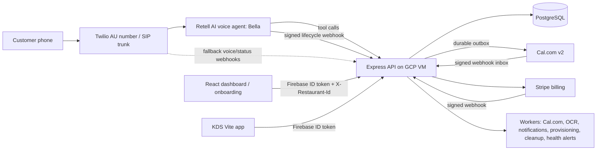

# VoxTable Architecture

> ⚠️ **STALE — do not trust this document. Last accurate 23 July 2026.**
>
> It predates the 29 Jul 2026 api/worker split, so it still draws the backend as a single
> Express process on the GCP VM: there is no `worker.ts`, no Cloud Run staging, no `/admin`
> surface, and no legal-documents layer in the diagrams below. CLAUDE.md has always
> described this file as stale; the banner saying so was missing until now, and the line
> that used to sit here claimed the opposite.
>
> For current architecture use the Confluence docs (Vocotable space) and the root
> [`CLAUDE.md`](../../../CLAUDE.md). Kept in the repo for the historical picture of the
> pre-split design, which the VM still resembles most closely.

For day-to-day agent guidance, read the root [`CLAUDE.md`](../../../CLAUDE.md), [`AGENTS.md`](../../../AGENTS.md), and the deployment runbooks under [`deploy/runbooks`](../../../deploy/runbooks).

## System Overview

VocoTable is a voice-AI booking and restaurant operations platform. Customers call a restaurant phone number, Twilio routes the call to Retell AI, Bella handles the conversation, and the backend writes reservations, call logs, orders, menu data, billing state, and onboarding state to PostgreSQL. The React dashboard and KDS read the same backend through Firebase-authenticated APIs.



## Applications

- `apps/backend`: Node 20, TypeScript, Express, PostgreSQL, Zod, Firebase Admin, Stripe, Twilio, Retell SDK, and background workers.
- `apps/frontend`: React 19 Vite SPA for landing, auth, onboarding, dashboard, billing, live tables, live feed, booking log, menu, analytics, and profile.
- `apps/kds`: separate Vite kitchen display app for active orders.

Frontend hosting is Firebase Hosting. The backend runs on the GCP VM behind nginx and Docker Compose.

## Backend Structure

```text
apps/backend/src
├── app.ts                  Express app, CORS, raw body capture, rate limits, router mount order
├── server.ts               startup, Sentry, cache warmup, worker lifecycle, graceful shutdown
├── auth                    Firebase auth, email allowlists, tenant resolution, role gates
├── config/env.ts           Zod env parsing and production safety checks
├── db                      pg pool, custom SQL migration runner, seed data
├── http                    schemas, async handler, error handler, request logger, rate limiters
├── repositories            raw SQL access
├── routes                  thin route handlers
├── services                booking, availability, Retell, Twilio, Cal.com, Stripe, OCR, notifications
├── utils                   logger, phone, time, Sentry helpers
└── workers                 async queues and scheduled jobs
```

Routes currently mounted by `app.ts`:

- `health.ts`: root and health endpoints.
- `availability.ts`: availability checks.
- `bookings.ts`: reservation create/update/cancel/status mutations.
- `retell.ts`: Retell inbound, lifecycle webhooks, and tool endpoints.
- `twilio.ts`: Twilio fallback voice and status endpoints.
- `cal.ts`: Cal.com webhook and ops health.
- `menu.ts`: menu categories/items and menu OCR ingestion.
- `orders.ts`: table order and KDS order endpoints.
- `dashboard.ts`: call logs, reservations, analytics, tables.
- `billing.ts`: Stripe billing mirror, portal sessions, checkout sessions.
- `me.ts`: current user and memberships.
- `onboarding.ts`: restaurant onboarding wizard status and transitions.
- `restaurant.ts`: tenant restaurant profile.
- `staff.ts`: staff and invite management.
- `admin.ts`: platform admin provisioning and ops endpoints.
- `stripeWebhook.ts`: Stripe webhook ingestion.

## Voice Booking Flow

1. A customer calls the restaurant number.
2. Twilio routes the call to Retell through SIP.
3. Retell runs Bella with the configured voice/LLM and calls VocoTable tools when it needs availability, booking, menu, or order actions.
4. Tool endpoints validate payloads with Zod and call service-layer logic.
5. Booking writes use PostgreSQL transactions and advisory locks to avoid double booking.
6. Retell lifecycle webhooks persist call state, summaries, transcripts, recordings, latency, and analysis into `call_logs`.
7. Dashboard pages poll authenticated APIs and render current operational state.

The dashboard is multi-tenant. The inbound voice path remains deliberately conservative: do not trust an LLM-provided or caller-provided `restaurant_id`.

## Onboarding Flow

Self-serve onboarding is:

```text
create restaurant -> profile -> menu -> trial -> phone/provisioning -> live
```

The canonical state machine lives in `services/onboardingService.ts`.

- `account_created`, `profile`, `menu`, `trial`, `provisioning`, `live` are the happy path.
- `suspended` and `cancelled` are side states.
- Profile/menu/trial progress is owner-driven.
- Subscription/provisioning transitions are server-side through Stripe webhooks, workers, admin routes, or development-only fallbacks.

Development-only shortcuts are present so local onboarding is usable when Stripe and automatic telephony provisioning are disabled. They are gated by `env.APP_ENV !== "production"` and must not be used as production behavior.

## Billing

Billing is Stripe-backed and tenant-scoped.

- `GET /api/billing/*` mirrors subscription, invoices, and payment method state.
- `POST /api/billing/portal-session` creates a Stripe Customer Portal URL.
- `POST /api/billing/checkout-session` starts a subscription checkout with the configured trial period.
- `POST /stripe/webhook` applies idempotent subscription events to onboarding state and can enqueue provisioning.

Billing is disabled unless `STRIPE_BILLING_ENABLED=true` and required Stripe credentials are present. Production env validation enforces this when enabled.

## Cal.com Mirror

Cal.com sync is asynchronous and never blocks the voice path.

- Booking creation enqueues `outbox_calcom` in the same DB transaction.
- `calcomOutboxWorker` posts to Cal.com with idempotency and backoff.
- `POST /cal/webhook` verifies Cal.com HMAC, deduplicates inbox events, and reconciles reservations.
- `CALCOM_SYNC_ENABLED=false` leaves the voice path working and disables external sync.

## KDS and Orders

The KDS app polls order endpoints and uses optimistic locking with `If-Match` headers. It is hosted as a separate Firebase Hosting target. Production CORS allows the KDS domains separately from the main dashboard.

## Tenancy and Roles

Dashboard/API tenancy uses:

```text
requireFirebaseAuth -> resolveTenant -> requireMemberRole(...)
```

`X-Restaurant-Id` is a selector only. The backend validates it against memberships on every tenant-scoped request.

Roles include owner, manager, staff/server, and kitchen. Frontend role gating is UX only; server-side gates are authoritative.

## Security and Observability

- External payloads are validated with Zod.
- Webhooks verify signatures in production.
- Logs go through `utils/logger.ts` with redaction.
- `requestLogger.ts` propagates request IDs through AsyncLocalStorage.
- Sentry is initialized at startup when configured.
- App-level rate limiting sits behind nginx rate limits.

## Data and Migrations

PostgreSQL is accessed through `pg` and raw SQL repositories. There is no ORM.

- Migrations are plain SQL files under `apps/backend/db/migrations`.
- The custom runner records applied filenames in `schema_migrations`.
- Reservation dates/times are restaurant-local wall-clock values.
- Lifecycle timestamps are `TIMESTAMPTZ`.
- Restaurant timezone comes from the restaurant profile/settings data.

## Deployment

Current production shape:

- Backend: GCP VM `core-central-vm`, Docker Compose, nginx, certbot.
- API domain: `https://vocotable.algorythmos.com.au`.
- Frontend: Firebase Hosting, including the main app and KDS target.
- DNS: Cloudflare-managed records for the production domains.

Use [`gcp-deployment.md`](./gcp-deployment.md), [`provisioning-runbook.md`](./provisioning-runbook.md), and `deploy/runbooks/` for operational steps.
